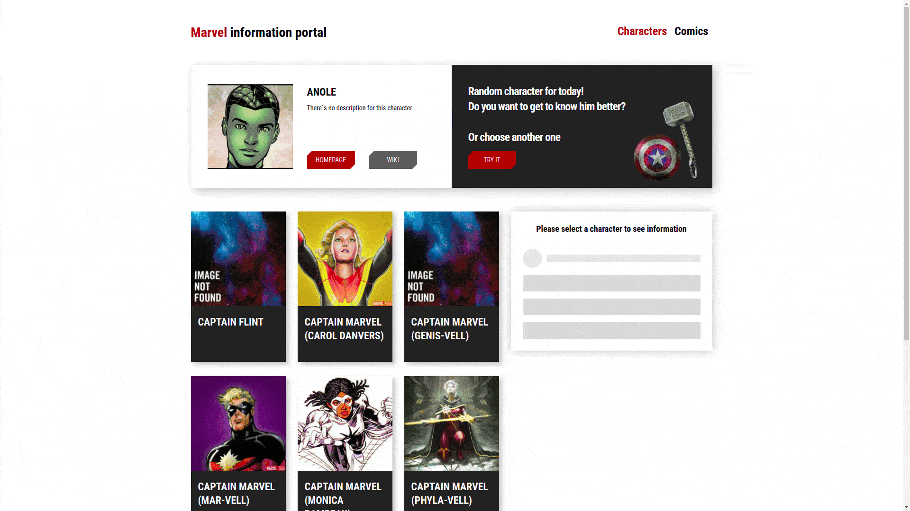

# Приложение Marvel Informational Portal
Реализовано с помощью *The Marvel Comics API*. Здесь собрана информация о комиксах и персонажах Марвел: в разделе *Characters* можно выбрать случайного героя и по нажатию на кнопку перейти на сторонний ресурс с более детальной информацией о нем. Конкретного персонажа можно найти в этом же разделе в списке, его данные появятся в панели справа. Во втором разделе *Comics* можно найти информацию о комиксах из списка.
###### JavaScript, React(hooks)

